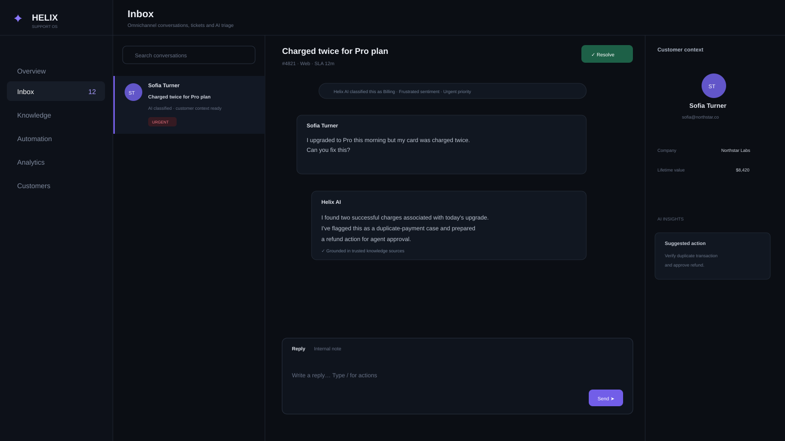

# Helix — AI Customer Support OS

A modern AI + human customer support workspace built as a production-style portfolio project.



## Product capabilities
- Omnichannel-style support inbox and ticket queue
- AI priority, intent and sentiment classification
- Human handoff and agent resolution workflow
- AI-assisted reply drafting
- Customer context and conversation history
- SLA visibility and priority handling
- Knowledge / RAG-ready architecture
- Automation and routing workspace
- Support analytics and customer intelligence
- Responsive dark SaaS interface

## Stack
React · Vite · Lucide React

## Run locally
```bash
npm install
npm run dev
```

## Production extension
Ready to connect with an LLM/RAG service, vector database, CRM/helpdesk APIs, email and messaging channels, authentication, database, webhooks and workflow automation.

**Portfolio project by AvyronHQ**
